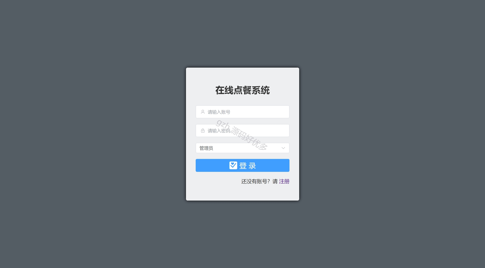
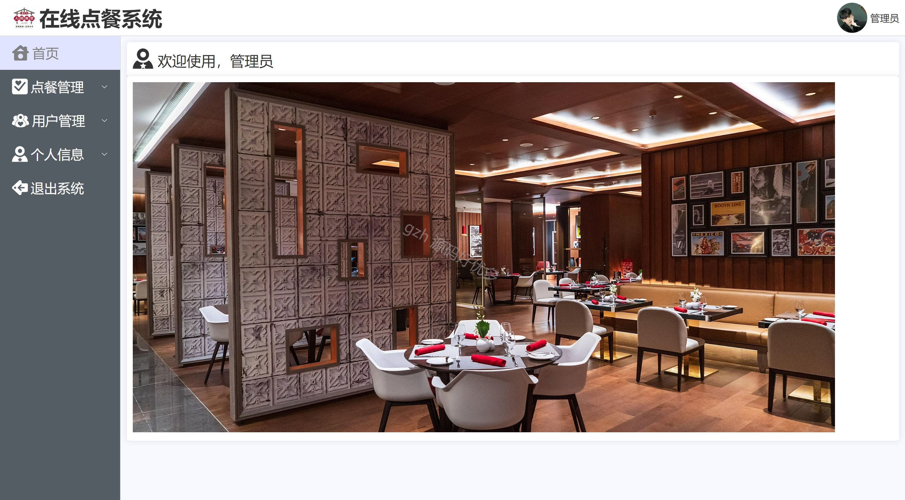
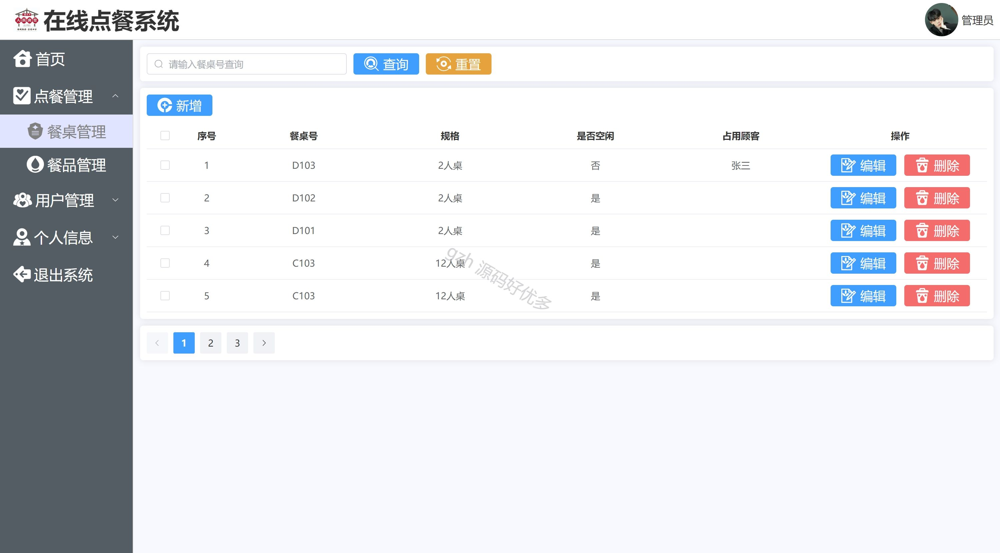
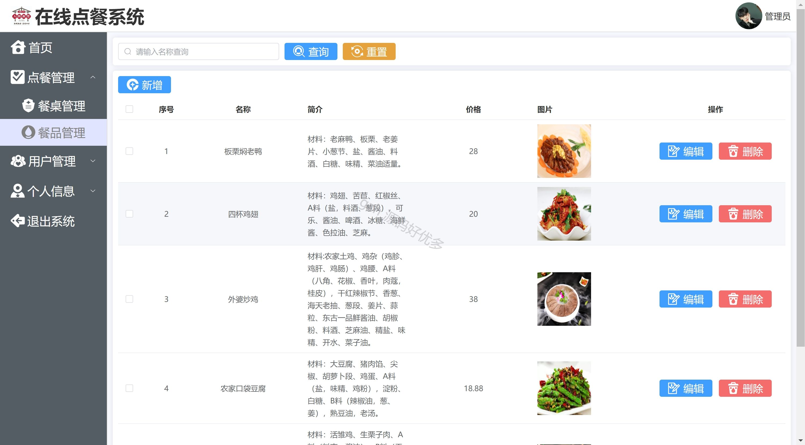
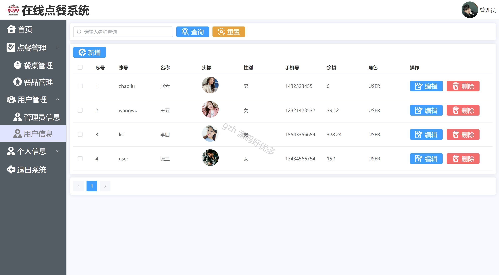
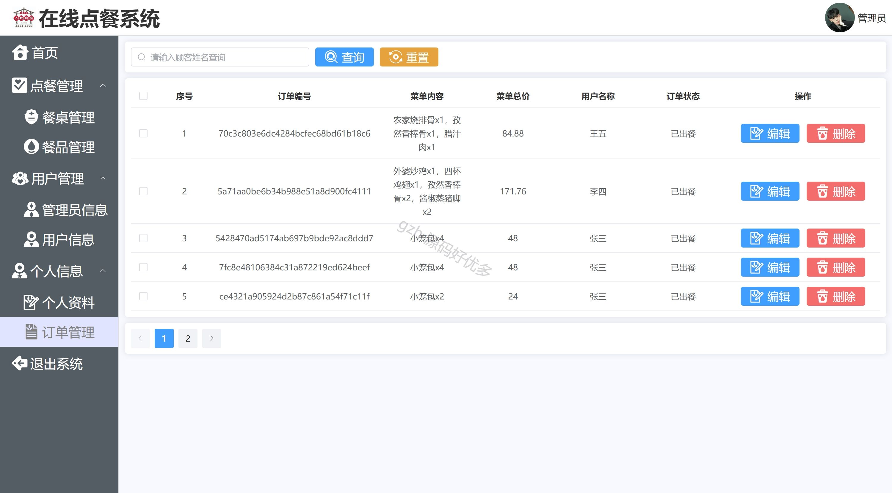
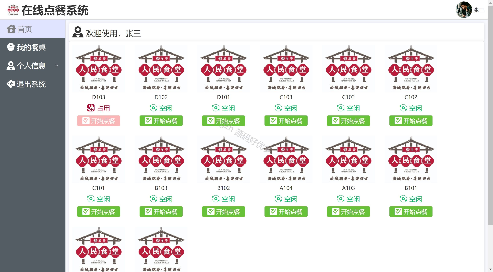
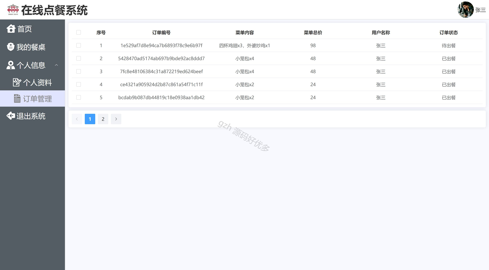
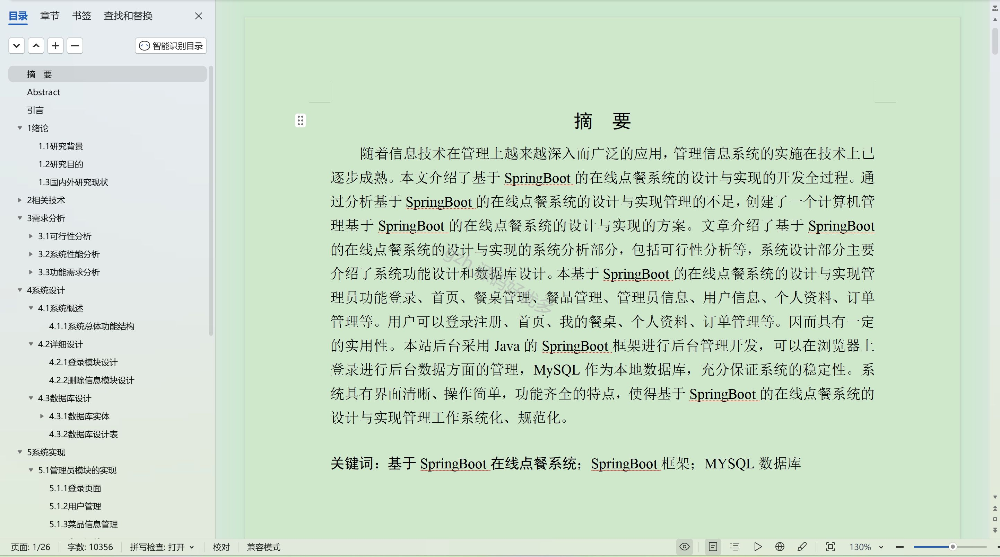

 
## 查看主页获取源码

### 一、作品包含

源码+数据库+设计文档万字+PPT+全套环境和工具资源+部署教程

### 二、项目技术

前端技术：Html、Css、Js、Vue、Element-ui

数据库：MySQL

后端技术：Java、Spring Boot、MyBatis

  

### 三、运行环境

开发工具：IDEA/eclipse

数据库：MySQL5.7

数据库管理工具：Navicat10以上版本

环境配置软件： JDK1.8+Maven3.6.3

前端Nodejs：16

### 四、项目介绍
项目编号：springbootA347

在当今快节奏的现代生活中，在线点餐系统应运而生。随着互联网技术的飞速发展和人们生活方式的转变，越来越多的人追求便捷、高效的餐饮服务体验。在线点餐系统为消费者和餐饮商家搭建了一座桥梁，让你无需亲临餐厅，即可轻松浏览各类美食菜单，随时随地进行点餐操作。它不仅节省了你的时间，还为你提供了更多的选择和个性化的服务。对于餐饮商家而言，在线点餐系统能够优化点餐流程，提高服务效率，减少人力成本，同时通过数据分析更好地了解顾客需求，为餐厅的经营决策提供有力支持。

后台分为管理员和用户
管理员的功能：登录、首页、餐桌管理、餐品管理、管理员信息、用户信息、个人资料、订单管理。
用户的功能：登录注册、首页、我的餐桌、个人资料、订单管理。

### 五、运行截图

  
